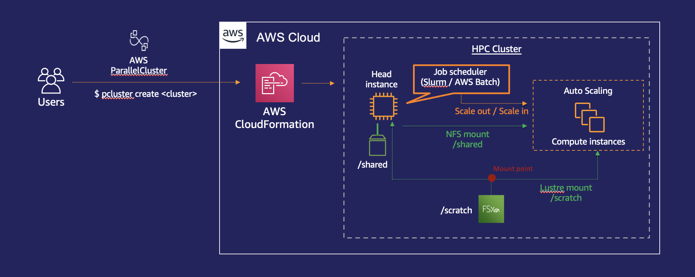

# How to run a CFD application (OpenFOAM) on Singularity with AWS ParallelCluster
 
[AWS ParallelCluster](https://aws.amazon.com/hpc/parallelcluster/) is an open-source cluster management tool that makes it easy for you to deploy an elastic High Performance Computing cluster on AWS. Below is the architecture diagram that you are going to build following the steps below. 



## Step 1. Configure an HPC environment on AWS using ParallelCluster

The recommended way of deploying an AWS ParallelCluster environment is by using [PCluster Manager](https://github.com/aws-samples/pcluster-manager). 
Follow the steps [here](https://github.com/aws-samples/pcluster-manager/blob/main/README.md) to create your AWS ParallelCluster environment. 

You will need to create a cluster with the following configuration:
- Slurm scheduler  
- An EBS volume for static data (in this example we will name it /shared)
- An FSx for Lustre volume for dynamic data (in this example we will name it /scratch)
- A queue with at least 4x c5n.18xlarge instances (in this example we will name it "c5n")

Alternatively you can use the [configuration file](pcluster/pc-openfoam-singularity.yaml) to deploy the cluster environment. Make sure you update all the <PLACEHODLER_VALUES> with actual values you are intending to configure. 

## Step 2. Install SingularityCE on your cluster
[Singularity Community Edition](https://sylabs.io/singularity/) is an open source, BSD licensed container software that is frequently used with High Performance Computing workloads. 
Check out the [documentation](https://docs.sylabs.io/guides/main/user-guide/) to find out more about SingularityCE. 

Follow the [Quick Installation Steps](https://docs.sylabs.io/guides/main/user-guide/quick_start.html#quick-installation-steps) to install SingularityCE.  

**Note: the following steps assume that you install Singularity CE onto the /shared directory.**

## Step 3. Create your own Singularity image

We will start by updating the **singularity.conf** file with the file systems we have configured on AWS ParallelCluster. 

```bash
vi /shared/singularity-ce-{$VERSION}/etc/singularity/singularity.conf
```

Add the following lines under the session "BIND PATH: [STRING]"

```bash
bind path = /scratch
bind path = /shared
```
Now we will create a sandbox environment where we can modify an Ubuntu 20.04 image.  

```bash
sudo su
singularity build --sandbox ubuntu2004 docker://ubuntu:focal
singularity shell --writable ubuntu2004/
```
You should now see a `Singularity>` prompt, meaning you have entered the container image in writable mode. In your container, execute the following to mkdir the directories to mount our filesystems on.

```bash
apt-get update && apt-get upgrade
mkdir /scratch
mkdir /shared 
```
In the container, execute the following to install all the dependencies on the container image. 

```bash
apt-get install -y build-essential flex bison cmake zlib1g-dev libboost-system-dev libboost-thread-dev libopenmpi-dev openmpi-bin gnuplot libreadline-dev libncurses-dev libxt-dev qt4-dev-tools libqt4-dev libqt4-opengl-dev freeglut3-dev libqtwebkit-dev libscotch-dev libcgal-dev gcc g++ gfortran curl vim cmake wget
```

Now install the [EFA](https://aws.amazon.com/hpc/efa/) driver. With EFA, High Performance Computing (HPC) applications using the Message Passing Interface (MPI) and Machine Learning (ML) applications using NVIDIA Collective Communications Library (NCCL) can scale to thousands of CPUs or GPUs.

```bash
curl -O https://efa-installer.amazonaws.com/aws-efa-installer-1.12.3.tar.gz
tar zxvf aws-efa-installer-1.12.3.tar.gz
cd aws-efa-installer
./efa_installer.sh -y
```

Set up your environment for OpenMPI.

```bash
export PATH=/opt/amazon/openmpi/bin:$PATH
export LD_LIBRARY_PATH=/opt/amazon/openmpi/lib:$LD_LIBRARY_PATH
# Check the MPI version (with AWS ParallelCluster you should have Open MPI installed)
mpirun --version
```

## Step 4. Install OpenFOAM

If you've exited your container, log back in again. 

```bash
singularity shell --writable ubuntu2004/
```

Now it's time to intstall OpenFOAM.

> **"export WM_NCOMPROCS=8"** specifies the number of cores to use for the compilation. If you have an environment where you can leverage on a larger number of cores, specify a larger number so that it speeds up the installation process. Depending on the number of cores, this process can take up to a few hours. 

```bash
cd /shared
wget https://sourceforge.net/projects/openfoam/files/v2012/OpenFOAM-v2012.tgz
tar -xvzf OpenFOAM-v2012.tgz
cd /shared/OpenFOAM-v2012
source /shared/OpenFOAM-v2012/etc/bashrc
export WM_NCOMPROCS=8  
./Allwmake > log.data
```

If you see a similar message to this at the end of your log file, you have successfully compiled OpenFOAM on your Singularity image. 

```
2021-01-06 08:36:05 +0000
========================================
Finished compile of visualization with OpenFOAM-v2012
  Gcc system compiler
  linuxARM64GccDPInt32Opt, with SYSTEMOPENMPI sys-openmpi


2021-01-06 08:36:05 +0000
========================================
  OpenFOAM-v2012
  Gcc system compiler
  linuxARM64GccDPInt32Opt, with SYSTEMOPENMPI sys-openmpi

  api   = 2012
  patch = 0
  bin   = 308 entries
  lib   = 148 entries

========================================
```

Define the environment variables on your Singularity image. Exit the singularity image with **Ctrl+D** and execute the following commands as root.

```bash
echo "source /shared/OpenFOAM-v2012/etc/bashrc" >> /shared/ubuntu2004/.singularity.d/env/99-openfoam.sh
chmod 755 /shared/ubuntu2004/.singularity.d/env/99-openfoam.sh
```

Finally, build the image and change the owner of the sif file. 

```bash
singularity build openfoam-ub2004.sif ubuntu2004/
chown ec2-user:ec2-user openfoam-ub2004.sif
```

## Step 5. Run OpenFOAM with a sample data set

In this example we will run the 4M morotbike cell case. Download the case data onto your cluster by executing the following commands:

```bash
cd /scratch
wget https://static.us-east-1.prod.workshops.aws/public/6d6877a7-c886-44c8-9df1-cc2f5a8a60c5/static/motorBikeDemo.tgz
tar -xvzf motorBikeDemo.tgz
```

Then place the container under the **/scratch** directory and make sure that the job script [submit-container.sh](scripts/submit-container.sh) is also placed under the same directory.  

```bash
cd /scratch
cp -p /shared/openfoam-ub2004.sif .
```

Submit your job into the compute resources using Slurm. Make sure you have at least 4x instances of c5n.18xlarge configured for the queue "c5n". If you're not familiar with Slurm, refer to the [Slurm workload manager documentation](https://slurm.schedmd.com/).

```bash
sbatch submit-container.sh
```
This should start your OpenFOAM job on AWS with Singularity containers. Use the `squeue` command to check the status of your job. 

```bash
squeue
```

## (Optional) Upload your container on a public repository

You can upload your own Singularity container image on [Sylabs](https://cloud.sylabs.io/). In order to do so you will need an account on Sylabs. Follow the [Sylabs documentation](https://sylabs.io/docs/) to find out how you can sign and upload your own container image. 
